<!-- Maps tell stories.

NASA satellite images of the color of the ocean can also tell a story.

We will discuss a geo-imaging pipeline for processing a time series of NASA satellite images, hosting on Mapbox, and using D3.js and Plot.ly to interactively visualize data from our oceans over time.

ePi Rational built an imaging & mapping pipeline for Oceaneos.org that processed NASA satellite images to visualize trends in phytoplankton in the ocean.

Oceaneos is studying Ocean Seeding. A simple idea: that adding nutrients to a depleted marine ecosystem will stimulate photosynthesis, causing plankton to grow, thus restoring the bottom of the marine food chain that fish require for growth.

We will discuss our geo-image pipeline for processing NASA GeoTiffs using GDAL and hosted at Mapbox.com, and other open source Javascript libraries for data visualization.

We also utilized NumPy to compute basic statistics on the GeoTiffs.

We will also discuss our data compression techniques for operating on floating point GeoTiff data, as well as image compression with WebP.

The implemented web page design is built on top of D3.js and a Plotly.js time series graph at the bottom of the map.

When the user clicked on a particular date, the Mapbox map would also update to the chlorophyll levels time series for a time slice in the 13 year span.

Plotly.js events are captured and routed to Mapbox GL JS, which then makes updates to the map with images from Mapbox.com. -->


<!--  Links


* GDAL2Tiles  http://wiki.osgeo.org/wiki/GDAL2Tiles_SoC_2007
* G'Mic - http://gmic.eu
* Color Advice -  http://www.kennethmoreland.com/color-advice/
* Visualizing and laying out time-series data built on D3.js —  https://www.metricsgraphicsjs.org
* A new image format for the Web — https://developers.google.com/speed/webp/
 -->


# Using Mapbox and GDAL to Visualize Trends in

# Ocean Phytoplankton from NASA Earth Observations Satellite Images
<br>
## Command Line Cartography

<br>


http://RobLabs.com

<br>


http://Oceaneos.org

<br>

## Presented at FOSS4G 2017 Boston, Wed Aug 16, 2017
---

# Oceaneos Marine Research Foundation


Adding nutrients to a depleted marine ecosystem.

---
# Icelandic Volcano

|   |   |
| - | - |
|   |   |
|   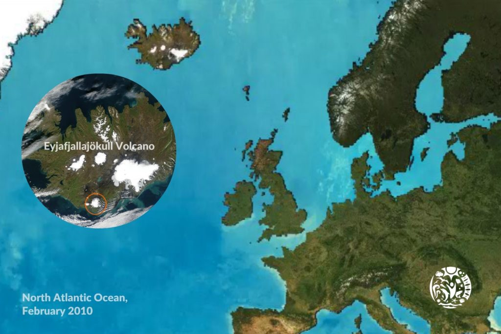 |  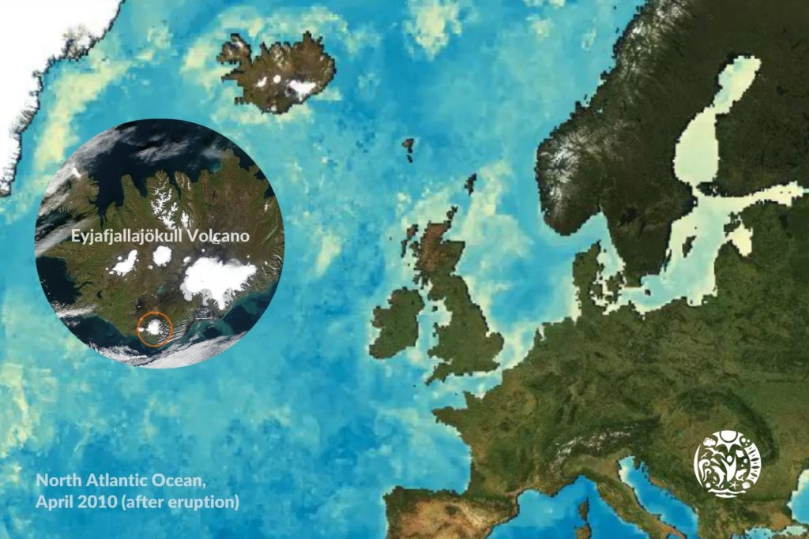 |

---

# NASA Earth Observations (NEO)

---

### One of the best places to study Earth is from space.
<br>
### NASA satellites continually orbit the globe, collecting information about Earth’s ocean, atmosphere, and land surfaces.
<br>
### Satellites can even monitor the activity of life forms, such as _phytoplankton_, from their remote vantage points.
<br>
### NEO is part of the EOS Project Science Office located at NASA Goddard Space Flight Center.

---

# NEO

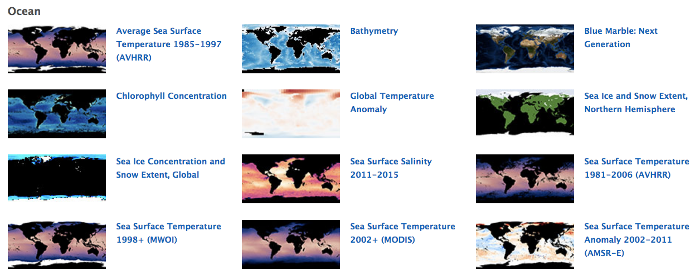

---

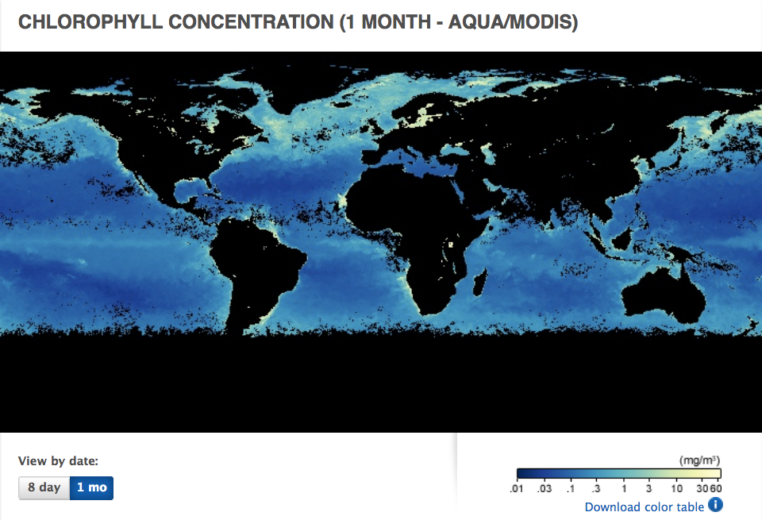

---


---

NEO Data Available

* JPEG, PNG
* GeoTIFF
  * 8-bit index (perfect for color LUT)
  * 32-bit floating point (perfect for computations)
* Pixels on the scale of 1.0° to 0.1°
* Monthly data since June 2002
  * > 180 months
* 8-day data since July 2002
  * > 650 8-day periods

---

# Architecture - Use `gdal2tiles.py` to Tile 0.1° GeoTIFFs
<br>


```bash
gdal_translate -of vrt file.tif out.vrt

gdal2tilesp.py -z 0-6 -f PNG out.vrt out
```


---
# Geo-Imaging pipeline
## Simply
* Download >800 images from NASA
* preprocess
* Apply Color Lookup table
* GDAL2Tiles
* Upload `mbtiles` to Mapbox.com

---

<!-- https://github.com/oceaneos/MapBox/issues/21 -->
### Image Healing
#### G'MIC `inpaint`

|   |   |
| - | - |
|   |   | 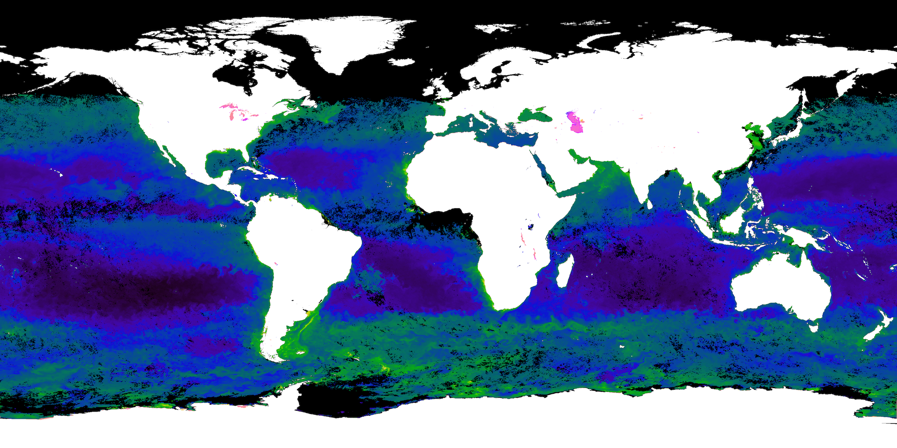 | 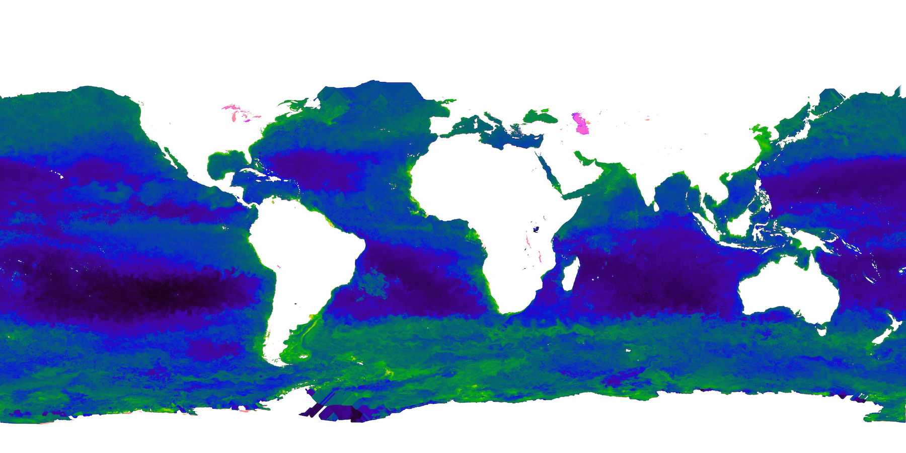


* _Rejected my own work_ — but could make better use of G'MIC
* We used an imaging healing method in Photoshop

---


``` bash
gmic kindlmann-MY1DMM_CHLORA_2016-01.tif -to_colormode 3 \
  bathy.3600x1800.threshold.png \
  -blend xor \
  --select_color[0] 0,0,0,0 \
  -inpaint[0] [1],0 \
  -o result.png
```

gmic.eu

---

# Color Lookup Tables (cLUT)


---

# Color Advice


|   |   |
| - | - |
|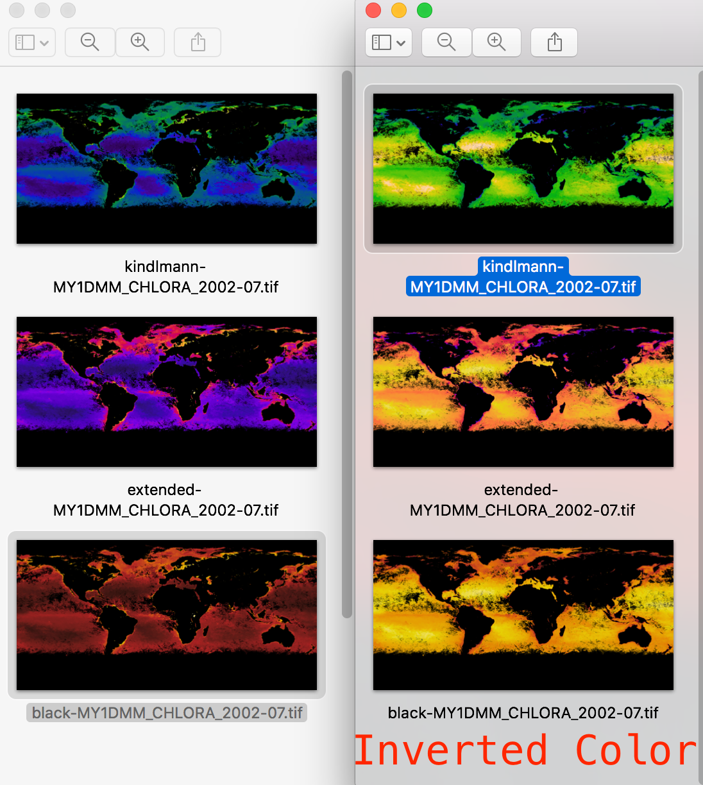| 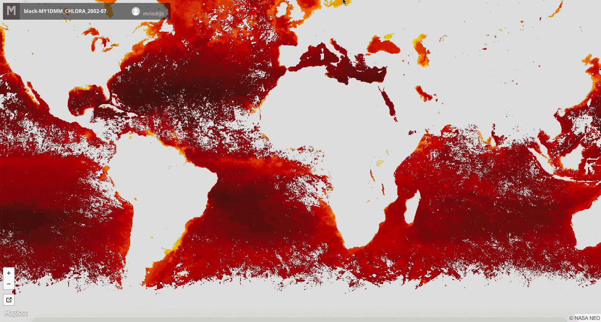

http://KennethMoreland.com/color-advice


---

# `gdal2tiles.py`

|   |   |
| - | - |
|   |   |
| | 

---

# Overlay over Google Mapbox

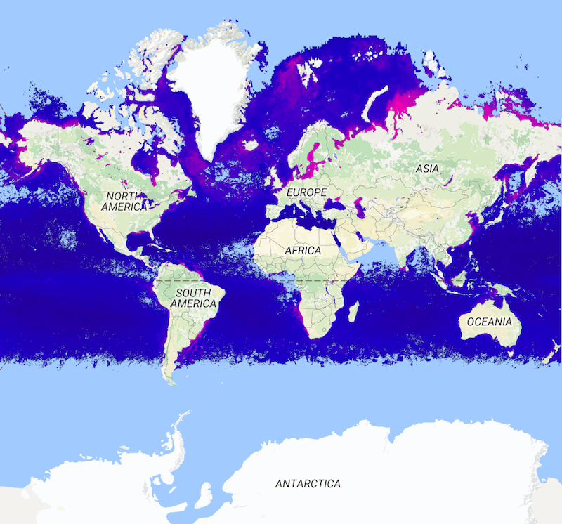

* Preferred no text nor borders

---

# Chlorophyll over Mapbox Satellite


---

Done once ... now scale

---

# Upload a `MBTile` to Mapbox.com


* Initial 5.0 GB on Mapbox.com
* With PNG Pipeline, hit the 5.0 GB limit after 43 months of data

---
# Image Compression

GDAL drivers to the rescue

---

# Solution `WebP`


* Use the `WebP` driver in GDAL to compress the data even smaller
* `WebP` tiles are ~1/3 the size of PNG tiles (~15 MB vs. ~45 MB per month)

---

# Time Series

---

# NumPy for Data Analysis

```bash
float = gdal.Open('MY1DMW_CHLORA_2016-09-05.FLOAT.TIFF')
f = numpy.array(float.GetRasterBand(1).ReadAsArray())
grid = numpy.meshgrid(f)

# Extract chlorophyll less than 1.0
t = numpy.less (grid , 1.0)
choice = numpy.logical_and(t , grid)
lowPlankton = numpy.extract(choice, grid)

```

---

# Displaying the Time series
<br>
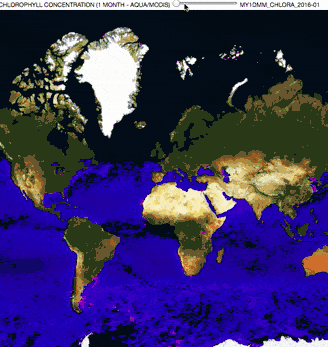

* _Rejected my own work_ - Slider would not work with >160 months of satellite data

---

# MetricsGraphics.js
## Visualizing and laying out time-series data built on D3.js
<br>
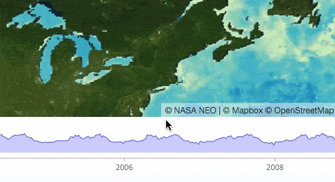

* Next try `Plot.ly`

---

# Plot.ly
## D3.js charting for science
<br>
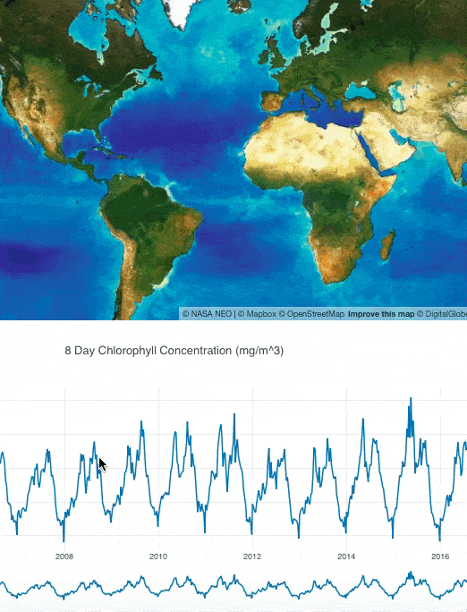


---

# The Oceaneos Global Chlorophyll Map


http://Oceaneos.org/chlorophyllmap

---
# Summary — Maps tell stories

* Scale
* Maps as a time series
* Image compression
* Visualization libraries for the Javascript

---

# Summary of Tools

* OSGEO — http://osgeo.org
  * `gdal2tiles.py`
  * `gdal2tilesp.py` — parallel processing, https://github.com/roblabs/gdal2tilesp
  * `WebP` driver — http://developers.google.com/speed/webp
<br>
* Mapbox
  * http://Mapbox.com for hosting of tilesets
  * Mapbox GL for Javascript, for displaying  tilesets, https://mapbox.com/mapbox-gl-js
  * `mb-util` for packing `mbtiles`, https://github.com/mapbox/mbutil
  * `mapbox` CLI for uploading `mbtiles`, https://github.com/mapbox/mapbox-cli-py
<br>
* d3.js — http://d3js.org
  * MetricsGraphics.js — http://metricsgraphicsjs.org
  * Plot.ly — http://plot.ly
  * Final map was done in http://HighCharts.com

  ---

# Text & Online Resources

|   |   |
| - | - |
|   |   |
|   | 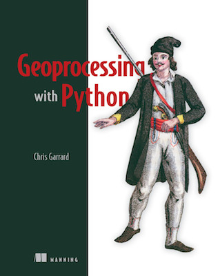 |


* Chris Garrard, Geoprocessing With Python, https://manning.com/books/geoprocessing-with-python

* Python GDAL/OGR Cookbook, https://pcjericks.github.io/py-gdalogr-cookbook/


---

# Thank You‼️
# Questions⁇


---

# Backup

---

# Vector Approach


* Extract raw data from Floating Point GeoTIFF for 1° grid
* Apply color map
* Draw using Mapbox GL JS tools

---

# Scaling `WebP`

|   |   |
| - | - |
|   |   |
|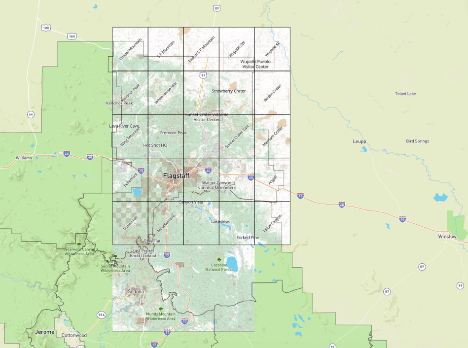| 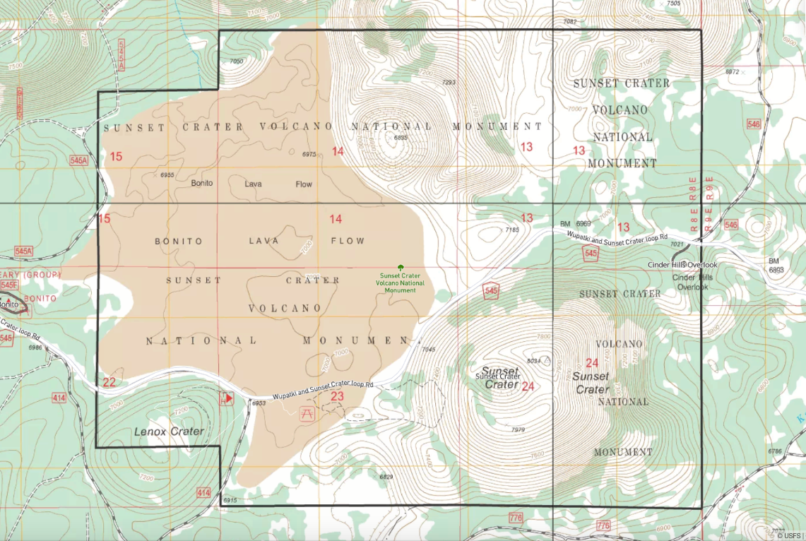

* 7.5 minute US Forest Service Topo Maps (FSTopo)
* http://RobLabs.com/flag
